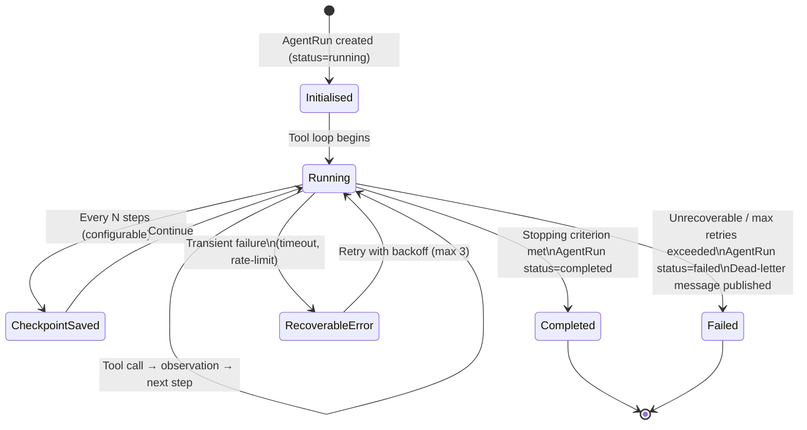

# KAATS — Agent Design

Version: 1.0 | Status: Authoritative

---

## 1. Overview

KAATS operates three autonomous agents, each built on **LangChain `AgentExecutor`** with **Azure OpenAI GPT-4o**. Every agent follows the **ReAct** (Reasoning + Acting) loop: the model reasons about the current state, selects a tool, observes the result, then reasons again until a stopping criterion is met.

All agents share:
- A common `AbstractAgent` base class
- Persistent run history in Azure Cosmos DB
- Token usage tracking per company
- Structured JSON logging to Azure Monitor
- A `WorkingMemory` scratch space for within-run key-value state
- A configurable `max_steps` ceiling and wall-clock timeout

---

## 2. Agent Catalogue

| Agent | Responsibility | Primary Inputs | Primary Outputs |
|---|---|---|---|
| `CrawlAgent` | Navigates a live system to discover UI flows and auto-generate requirements | System base URL, auth credentials, crawl scope | `Requirement` records in SQL; Cosmos run doc |
| `GenerationAgent` | Converts requirements into executable test scripts in one or more formats | `Requirement` IDs, target format(s) | `TestScript` + `TestCase` + `TestStep` records in SQL |
| `ExecutionAgent` | Runs test scripts step-by-step, captures screenshot evidence | `TestScript` ID | `TestExecution` + `TestStepResult` + `EvidenceScreenshot` records; PDF report in Blob |

---

## 3. Common Agent Lifecycle



### Lifecycle Steps

1. **Initialise** — Create `AgentRun` row in SQL (status=`running`), create Cosmos document skeleton.
2. **Build context** — Load `WorkingMemory`, any checkpoint state, system prompt for this agent type.
3. **Tool loop** — `AgentExecutor.arun()` iterates: reason → select tool → execute tool → observe → reason.
4. **Checkpoint** — Every `checkpoint_every_n_steps` (default: 10), serialise `WorkingMemory` + intermediate results to Cosmos document. Allows resuming after worker restart.
5. **Token tracking** — After each LLM call, increment `AgentRun.prompt_tokens` and `completion_tokens`. Aggregate daily to `CompanyTokenUsage` table.
6. **Stop** — When the model emits `Final Answer` or max_steps is reached.
7. **Finalise** — Update SQL record (status, duration_ms, token counts). Mark Cosmos document `completed`.
8. **Error handling** — Transient errors (HTTP 429, connection timeout) retry with exponential backoff. Unrecoverable errors set status=`failed` and publish to dead-letter topic.

---

## 4. WorkingMemory

`WorkingMemory` is a per-run, in-process key-value store with typed slots. It is serialised to the Cosmos run document at each checkpoint so it survives worker restarts.

```
WorkingMemory
├── discovered_pages        List[PageSummary]        (CrawlAgent)
├── visited_urls            Set[str]                 (CrawlAgent)
├── generated_requirements  List[RequirementDraft]   (CrawlAgent → GenerationAgent)
├── pending_scripts         List[ScriptDraft]        (GenerationAgent)
├── current_step_index      int                      (ExecutionAgent)
├── passed_steps            List[int]                (ExecutionAgent)
├── failed_steps            List[int]                (ExecutionAgent)
└── scratch                 Dict[str, Any]           (all agents — free-form)
```

---

## 5. CrawlAgent

### Purpose
Navigates a live software system to discover all significant UI flows and generate structured requirements. Operates like a QA analyst exploring an unknown application.

### System Prompt (condensed)
```
You are a meticulous QA analyst crawling a web application to discover every
significant user flow. For each page or workflow you find, extract:
- The purpose of the page
- All interactive elements (buttons, forms, navigation)
- Pre-conditions (what must be true before this page is reachable)
- Post-conditions (what happens after completing the flow)

Do not make assumptions about the industry or business domain. Use neutral
terminology. Produce structured requirement documents.
```

### Tool Set

| Tool | Description |
|---|---|
| `navigate_to_url` | Load a URL in the headless browser |
| `get_page_title` | Return current page `<title>` |
| `get_page_text` | Extract visible text content (no HTML) |
| `get_interactive_elements` | Return all clickable/input elements with labels, types, IDs |
| `click_element` | Click by CSS selector or accessible label |
| `fill_input` | Fill a form field by selector and value |
| `submit_form` | Submit the nearest enclosing form |
| `get_navigation_links` | Return all `<a>` hrefs scoped to the same origin |
| `take_screenshot` | Capture PNG of current viewport |
| `get_current_url` | Return current browser URL |
| `go_back` | Browser back navigation |
| `save_requirement_draft` | Persist a draft `Requirement` to `WorkingMemory` |
| `flush_requirements_to_db` | Bulk-insert finalised requirements to SQL |
| `check_visited` | Check whether a URL has already been crawled |
| `mark_visited` | Mark a URL as crawled in `WorkingMemory` |

### BFS Crawl Strategy
1. Start from `system.base_url`.
2. Extract all same-origin links from the current page.
3. Enqueue unvisited links (breadth-first).
4. Apply URL filters: skip file downloads (`.pdf`, `.zip`), skip auth callback endpoints, skip URLs matching `crawl_exclude_patterns`.
5. Save `Requirement` drafts to `WorkingMemory` as pages are processed.
6. Flush to SQL every 10 pages (checkpoint).
7. Stop when queue is empty or `max_pages` (default: 200) is reached.

### Stopping Criteria
- BFS queue exhausted
- `max_steps` reached
- `max_pages` reached
- Wall-clock timeout exceeded (`agent_timeout_seconds`, default: 1800)

---

## 6. GenerationAgent

### Purpose
Converts structured requirements into executable test scripts. Supports five output formats, selected per-company or per-invocation. Validates each generated script for syntactic correctness before saving.

### System Prompt (condensed)
```
You are a senior test automation engineer. Given a structured requirement document,
produce a complete, executable test script. The script must:
- Cover the primary happy path
- Cover the most critical edge cases
- Be self-contained (no external dependencies beyond the test framework)
- Use neutral step descriptions that do not assume industry-specific knowledge

Validate each script step by step before declaring it complete.
```

### Supported Script Formats

| Format | Description |
|---|---|
| `playwright_python` | Playwright async Python — executed by ExecutionAgent |
| `selenium_java` | Selenium WebDriver Java (for export only) |
| `cypress_js` | Cypress test suite (for export only) |
| `gherkin` | Gherkin `.feature` file (for documentation / BDD export) |
| `manual_steps` | Structured plain-language steps (for manual QA export) |

The `playwright_python` format is the canonical execution format. All other formats are generated for export and human review only.

### Tool Set

| Tool | Description |
|---|---|
| `fetch_requirement` | Load a `Requirement` record from SQL by ID |
| `list_requirements_for_system` | Return all requirements for a given system |
| `get_system_metadata` | Fetch system name, base URL, business domain |
| `save_script_draft` | Persist draft script to `WorkingMemory` |
| `validate_playwright_syntax` | Parse the generated Playwright script — raise if invalid |
| `decompose_requirement` | Split a requirement into discrete test steps |
| `generate_edge_cases` | Ask LLM to enumerate edge cases for a requirement |
| `insert_test_script` | Insert validated `TestScript` + `TestCase` + `TestStep` records to SQL |
| `get_existing_scripts` | Fetch existing scripts for deduplication check |
| `format_as_gherkin` | Convert step list to Gherkin syntax |
| `format_as_manual_steps` | Convert step list to plain-language steps |

### Generation Pipeline
1. Fetch requirement(s).
2. Decompose each requirement into atomic test steps.
3. Enumerate critical edge cases.
4. Generate Playwright Python script.
5. Validate syntax (`ast.parse` + Playwright import check).
6. If invalid, re-prompt with the parse error (max 3 re-prompts).
7. Generate auxiliary formats (gherkin, manual_steps) in parallel.
8. Insert all records to SQL.

---

## 7. ExecutionAgent

### Purpose
Executes a `TestScript` step-by-step against a live system, captures a screenshot after every step, evaluates pass/fail for each step, and bundles all evidence into a PDF report.

### System Prompt (condensed)
```
You are a meticulous QA engineer executing a test script against a live system.
For each step:
1. Perform the action described
2. Capture a screenshot
3. Evaluate whether the step passed or failed based on the expected outcome
4. Record your reasoning

Do not skip steps. Do not assume success without visual confirmation.
If a step fails, record the failure and continue unless the script is marked
stop-on-failure.
```

### Tool Set

| Tool | Description |
|---|---|
| `navigate_to_url` | Load a URL |
| `click_element` | Click by selector or label |
| `fill_input` | Fill a form field |
| `submit_form` | Submit a form |
| `select_option` | Select a dropdown value |
| `wait_for_element` | Wait for element to appear (with timeout) |
| `wait_for_navigation` | Wait for page navigation to complete |
| `get_element_text` | Read visible text of an element |
| `get_element_attribute` | Read an element attribute |
| `assert_element_visible` | Assert an element is present and visible |
| `assert_text_contains` | Assert page contains a text substring |
| `assert_url_matches` | Assert current URL matches a pattern |
| `take_screenshot` | Capture PNG and upload to Blob Storage |
| `annotate_screenshot` | Apply Pillow overlay (step number, description, pass/fail badge) |
| `record_step_result` | Write `TestStepResult` to SQL |
| `get_current_step` | Return current step definition from the script |
| `advance_step` | Increment step index in `WorkingMemory` |
| `mark_step_passed` | Record step as passed |
| `mark_step_failed` | Record step as failed with reason |
| `generate_pdf_report` | Bundle all annotated screenshots into PDF, upload to Blob |

### Execution Loop
```
for each step in TestScript.steps:
    1. Emit step to log
    2. Execute action(s) described in step
    3. take_screenshot → upload → annotate
    4. Evaluate expected outcome
    5. record_step_result (passed / failed / skipped)
    6. if failed and script.stop_on_failure: break
generate_pdf_report()
update TestExecution (status, duration_ms, passed_count, failed_count)
```

---

## 8. Error Recovery

### Transient Errors (retry)
| Error | Strategy |
|---|---|
| Azure OpenAI rate limit (HTTP 429) | Exponential backoff: 2s, 4s, 8s — max 3 retries |
| Connection timeout (Playwright) | Re-initialise browser context, retry step |
| SQL connection drop | Reconnect via SQLAlchemy pool, retry transaction |
| Cosmos write failure | Retry with jitter (1s, 2s, 4s) |

### Unrecoverable Errors
| Error | Action |
|---|---|
| max_retries exceeded on LLM call | Set `AgentRun.status = failed`, publish to dead-letter, alert |
| Playwright crash (non-retryable) | Save partial results, set status = failed |
| max_steps reached | Save checkpoint, set status = `timed_out` |
| Wall-clock timeout | `asyncio.wait_for` raises `TimeoutError` — save partial results, set status = `timed_out` |

### Dead-Letter Handling
Failed jobs land in the `ai-jobs/$deadletterqueue` subscription. The Scheduler Service checks the DLQ every 5 minutes and creates an alert record in the `alerts` SQL table. Platform admins are notified via Azure Monitor alert rule.

---

## 9. Token Usage Tracking

After every LLM call, the agent increments:
- `AgentRun.prompt_tokens`
- `AgentRun.completion_tokens`

At run completion, the worker upserts `CompanyTokenUsage`:
- `date` (current UTC date)
- `company_id`
- `agent_type`
- `prompt_tokens` (increment)
- `completion_tokens` (increment)

This table is the basis for billing visibility dashboards and rate limiting per company.

---

## 10. Configuration Reference

| Setting | Default | Description |
|---|---|---|
| `max_agent_steps` | 100 | Maximum ReAct loop iterations per run |
| `agent_timeout_seconds` | 1800 | Wall-clock timeout (30 min) |
| `agent_tool_timeout_seconds` | 30 | Per-tool-call timeout |
| `checkpoint_every_n_steps` | 10 | Steps between Cosmos checkpoints |
| `max_crawl_pages` | 200 | CrawlAgent page limit |
| `llm_max_retries` | 3 | Retries on transient LLM errors |
| `llm_retry_base_seconds` | 2 | Exponential backoff base |
| `generation_max_reformat_attempts` | 3 | Script re-generation attempts on validation failure |
| `evidence_retention_days` | 365 | Blob TTL for evidence artifacts |
