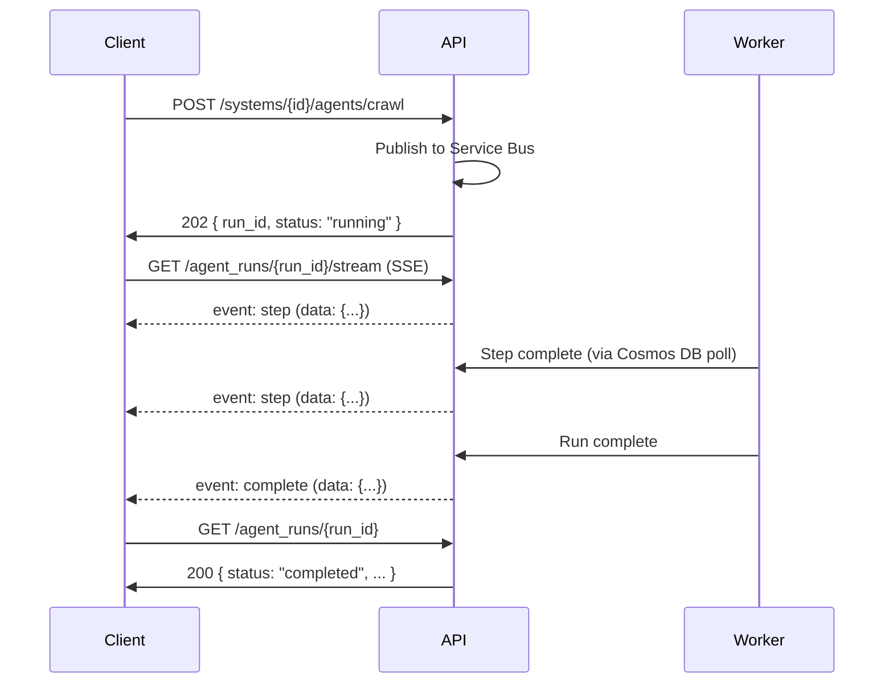

# KAATS — API Design

Version: 1.0 | Status: Authoritative

---

## 1. Principles

1. **RESTful resources** — URLs identify resources; HTTP verbs convey intent.
2. **Async-first** — All endpoints are `async def`. Long-running operations return a job handle; progress is streamed via SSE.
3. **Consistent envelope** — Every response uses the same JSON shape for data, pagination, and errors.
4. **Versioned** — All routes are prefixed `/api/v1/`. Breaking changes increment the version.
5. **Tenant-scoped** — Every request carries a JWT; `company_id` is extracted server-side, never accepted from the client in the request body.
6. **Idempotent mutations** — `PUT` is idempotent. `POST` is not. `DELETE` is idempotent.

---

## 2. Base URL and Versioning

```
Production:  https://api.kaats.kiu.ai/api/v1
Development: http://localhost:8000/api/v1
```

When a breaking change is required a new version path `/api/v2/` is introduced. The previous version is deprecated (documented in release notes) with a 6-month support window. Both versions are served simultaneously during the overlap.

Non-breaking additive changes (new optional fields, new endpoints) are made in place without incrementing the version.

---

## 3. Authentication

All endpoints except `/health` and `/api/v1/auth/*` require a valid **Bearer JWT** issued by Microsoft Entra ID.

```
Authorization: Bearer <jwt_token>
```

On validation failure the API returns `401 Unauthorized`. On insufficient permission it returns `403 Forbidden`.

Token refresh is handled client-side via the Entra ID SDK. The API does not issue or refresh tokens.

---

## 4. Request and Response Format

### 4.1 Content Type

All request and response bodies use `application/json`. Multipart form data (`multipart/form-data`) is used only for file upload endpoints.

### 4.2 Response Envelope

#### Single resource

```json
{
  "data": { ... },
  "meta": {
    "request_id": "req_01HX..."
  }
}
```

#### Collection (paginated)

```json
{
  "data": [ ... ],
  "pagination": {
    "page": 1,
    "page_size": 25,
    "total_items": 142,
    "total_pages": 6,
    "has_next": true,
    "has_prev": false
  },
  "meta": {
    "request_id": "req_01HX..."
  }
}
```

#### Empty success (204)

No body.

### 4.3 Error Envelope

All errors use HTTP status codes and a consistent body:

```json
{
  "error": {
    "code": "RESOURCE_NOT_FOUND",
    "message": "System with id 'abc-123' was not found.",
    "details": null,
    "request_id": "req_01HX..."
  }
}
```

#### Error Codes

| HTTP Status | Code | Meaning |
|---|---|---|
| 400 | `VALIDATION_ERROR` | Request body failed validation; `details` contains field errors |
| 401 | `UNAUTHENTICATED` | Missing or invalid JWT |
| 403 | `FORBIDDEN` | Authenticated but insufficient role |
| 404 | `RESOURCE_NOT_FOUND` | Entity does not exist (or RLS hides it) |
| 409 | `CONFLICT` | Unique constraint violation |
| 422 | `UNPROCESSABLE` | Business logic rejection (e.g., cron string invalid) |
| 429 | `RATE_LIMITED` | Too many requests |
| 500 | `INTERNAL_ERROR` | Unexpected server error — always logged |
| 503 | `SERVICE_UNAVAILABLE` | Dependency unavailable (SQL, Service Bus) |

---

## 5. Pagination

All collection endpoints support cursor-free offset pagination:

| Parameter | Type | Default | Max | Description |
|---|---|---|---|---|
| `page` | int | 1 | — | 1-indexed page number |
| `page_size` | int | 25 | 100 | Items per page |
| `sort` | string | `created_at` | — | Field to sort by |
| `order` | `asc` \| `desc` | `desc` | — | Sort direction |

Example:
```
GET /api/v1/systems?page=2&page_size=50&sort=name&order=asc
```

---

## 6. Filtering

Collection endpoints support field-level filtering via query parameters:

```
GET /api/v1/requirements?status=approved&priority=1
GET /api/v1/agent_runs?agent_type=execution&status=failed
GET /api/v1/scheduled_jobs?is_enabled=true
```

Date range filtering uses `_from` / `_to` suffixes:

```
GET /api/v1/test_executions?started_at_from=2026-05-01&started_at_to=2026-05-31
```

---

## 7. Endpoint Reference

### 7.1 Health

```
GET /health
```
Returns `200 OK` with `{"status": "ok"}`. No authentication required. Used by load balancer health checks.

---

### 7.2 Systems

| Method | Path | Description |
|---|---|---|
| `GET` | `/api/v1/systems` | List all systems in the caller's company |
| `POST` | `/api/v1/systems` | Create a new system |
| `GET` | `/api/v1/systems/{system_id}` | Fetch system details |
| `PUT` | `/api/v1/systems/{system_id}` | Update system config |
| `DELETE` | `/api/v1/systems/{system_id}` | Soft-delete system |

**POST /api/v1/systems request body:**
```json
{
  "name": "Acme CRM",
  "base_url": "https://crm.acme.example.com",
  "system_type": "web_app",
  "crawl_config": {
    "max_pages": 150,
    "exclude_patterns": ["*/admin/*", "*/logout"]
  },
  "auth_config": {
    "type": "username_password",
    "credential_secret_name": "kaats-acme-crm-creds"
  }
}
```

---

### 7.3 Requirements

| Method | Path | Description |
|---|---|---|
| `GET` | `/api/v1/systems/{system_id}/requirements` | List requirements for a system |
| `POST` | `/api/v1/systems/{system_id}/requirements` | Create a requirement manually |
| `GET` | `/api/v1/requirements/{requirement_id}` | Fetch requirement detail |
| `PUT` | `/api/v1/requirements/{requirement_id}` | Update requirement |
| `DELETE` | `/api/v1/requirements/{requirement_id}` | Delete requirement |
| `POST` | `/api/v1/requirements/{requirement_id}/approve` | Approve requirement |

---

### 7.4 Test Scripts

| Method | Path | Description |
|---|---|---|
| `GET` | `/api/v1/systems/{system_id}/scripts` | List scripts for a system |
| `POST` | `/api/v1/systems/{system_id}/scripts` | Create script manually |
| `GET` | `/api/v1/scripts/{script_id}` | Fetch script with all cases and steps |
| `PUT` | `/api/v1/scripts/{script_id}` | Update script metadata |
| `DELETE` | `/api/v1/scripts/{script_id}` | Delete script |
| `GET` | `/api/v1/scripts/{script_id}/export/{format}` | Export in specified format |

---

### 7.5 Agent Runs

| Method | Path | Description |
|---|---|---|
| `POST` | `/api/v1/systems/{system_id}/agents/crawl` | Trigger CrawlAgent |
| `POST` | `/api/v1/systems/{system_id}/agents/generate` | Trigger GenerationAgent |
| `POST` | `/api/v1/scripts/{script_id}/agents/execute` | Trigger ExecutionAgent |
| `GET` | `/api/v1/agent_runs` | List agent runs (filterable) |
| `GET` | `/api/v1/agent_runs/{run_id}` | Fetch agent run status and summary |
| `GET` | `/api/v1/agent_runs/{run_id}/steps` | Fetch step trace from Cosmos DB |
| `DELETE` | `/api/v1/agent_runs/{run_id}` | Cancel running agent |
| `GET` | `/api/v1/agent_runs/{run_id}/stream` | SSE stream of live step output |

**POST agent trigger response (202 Accepted):**
```json
{
  "data": {
    "run_id": "550e8400-e29b-41d4-a716-446655440000",
    "status": "running",
    "agent_type": "crawl",
    "started_at": "2026-05-13T10:00:00Z"
  },
  "meta": { "request_id": "req_01HX..." }
}
```

**GET /api/v1/agent_runs/{run_id}/stream (SSE):**
```
event: step
data: {"step_index": 1, "thought": "...", "tool": "navigate_to_url", "observation": "...", "timestamp": "..."}

event: step
data: {"step_index": 2, ...}

event: complete
data: {"status": "completed", "prompt_tokens": 12450, "completion_tokens": 3210}
```

---

### 7.6 Test Executions

| Method | Path | Description |
|---|---|---|
| `GET` | `/api/v1/scripts/{script_id}/executions` | List executions for a script |
| `GET` | `/api/v1/executions/{execution_id}` | Fetch execution with step results |
| `POST` | `/api/v1/executions/{execution_id}/rerun` | Re-run the same script |
| `DELETE` | `/api/v1/executions/{execution_id}` | Archive/delete execution |

---

### 7.7 Evidence

| Method | Path | Description |
|---|---|---|
| `GET` | `/api/v1/executions/{execution_id}/evidence` | List all screenshots for an execution |
| `GET` | `/api/v1/evidence/{screenshot_id}` | Fetch metadata + SAS URL for one screenshot |
| `GET` | `/api/v1/executions/{execution_id}/evidence/report` | Download PDF evidence report (redirect to SAS URL) |
| `POST` | `/api/v1/executions/{execution_id}/evidence/verify` | Verify SHA-256 integrity chain |

---

### 7.8 Scheduled Jobs

| Method | Path | Description |
|---|---|---|
| `GET` | `/api/v1/scheduled_jobs` | List scheduled jobs |
| `POST` | `/api/v1/scheduled_jobs` | Create a scheduled job |
| `GET` | `/api/v1/scheduled_jobs/{job_id}` | Fetch job details |
| `PUT` | `/api/v1/scheduled_jobs/{job_id}` | Update job (cron, enabled, agent_type) |
| `DELETE` | `/api/v1/scheduled_jobs/{job_id}` | Delete job |
| `POST` | `/api/v1/scheduled_jobs/{job_id}/trigger` | Manually trigger a due-now run |
| `GET` | `/api/v1/scheduled_jobs/{job_id}/runs` | List run history for a job |

**POST /api/v1/scheduled_jobs request body:**
```json
{
  "system_id": "system-uuid",
  "agent_type": "crawl",
  "cron_expression": "0 2 * * 1",
  "timezone": "America/New_York",
  "is_enabled": true,
  "max_failures": 3
}
```

---

### 7.9 Reporting

| Method | Path | Description |
|---|---|---|
| `GET` | `/api/v1/systems/{system_id}/reports/summary` | Project summary: requirement/script/execution counts, last run |
| `GET` | `/api/v1/systems/{system_id}/reports/coverage` | Script coverage: requirements with/without scripts |
| `GET` | `/api/v1/reports/token_usage` | Token usage for caller's company by date range and agent type |

---

### 7.10 Users and Roles

| Method | Path | Description |
|---|---|---|
| `GET` | `/api/v1/users/me` | Fetch current user profile |
| `GET` | `/api/v1/users` | List users in caller's company |
| `POST` | `/api/v1/users/invite` | Invite a new user to the company |
| `PUT` | `/api/v1/users/{user_id}/role` | Update a user's role |
| `DELETE` | `/api/v1/users/{user_id}` | Remove user from company |

---

## 8. Long-Running Operations

Any endpoint that enqueues an agent run returns `202 Accepted` immediately with a `run_id`. The client polls `GET /api/v1/agent_runs/{run_id}` or subscribes to the SSE stream `GET /api/v1/agent_runs/{run_id}/stream` for live updates.



---

## 9. Rate Limiting

| Scope | Limit | Window |
|---|---|---|
| Per company | 1000 requests | 1 minute |
| Agent trigger (per company) | 10 concurrent runs | Rolling |
| Token usage (per company) | Configurable per billing plan | Daily |

When rate limited, the API returns `429 Too Many Requests` with:
```
Retry-After: 30
X-RateLimit-Limit: 1000
X-RateLimit-Remaining: 0
X-RateLimit-Reset: 1715601600
```

---

## 10. Idempotency

For `POST` endpoints that create resources, clients may supply an `Idempotency-Key` header (UUID v4). If the same key is presented within 24 hours, the server returns the original response without re-executing the operation.

```
Idempotency-Key: 550e8400-e29b-41d4-a716-446655440000
```

---

## 11. CORS

The API allows requests from configured origins only. In production, only the KAATS frontend origin is whitelisted. The `Access-Control-Allow-Credentials: true` header is set to allow the SPA to send the Authorization header.
