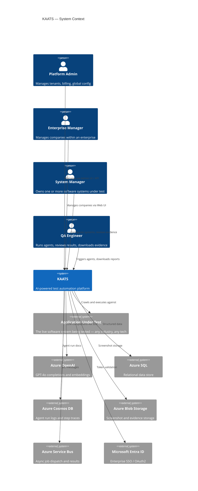
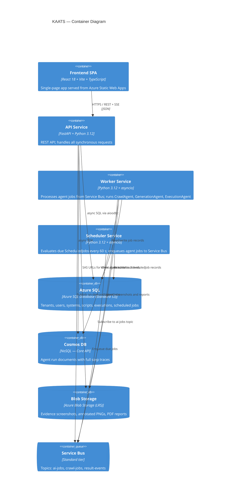
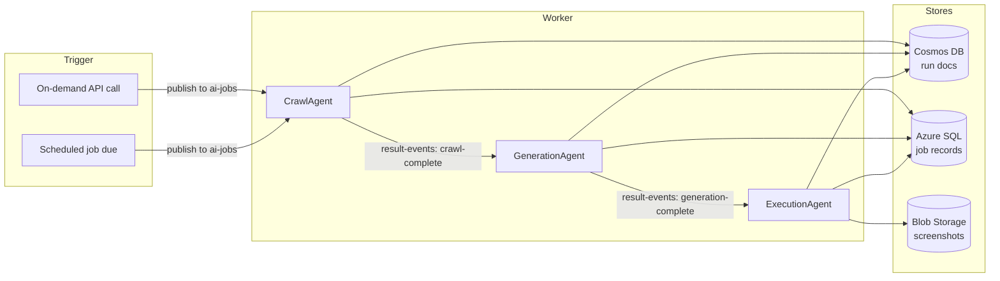
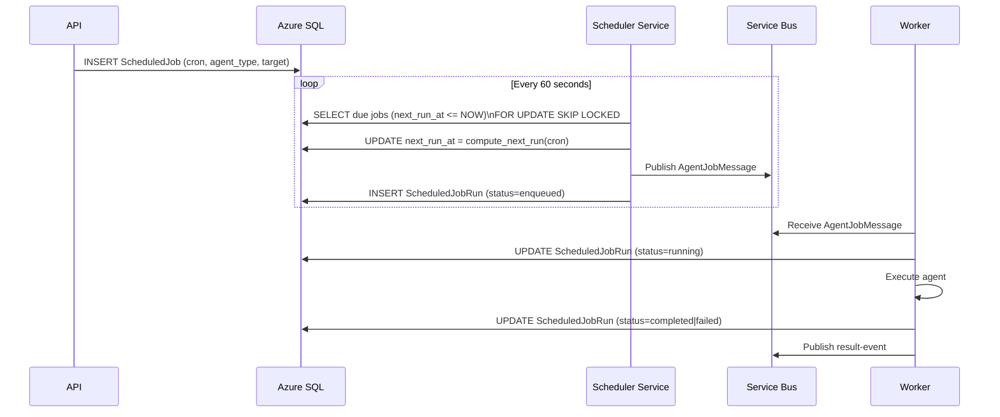
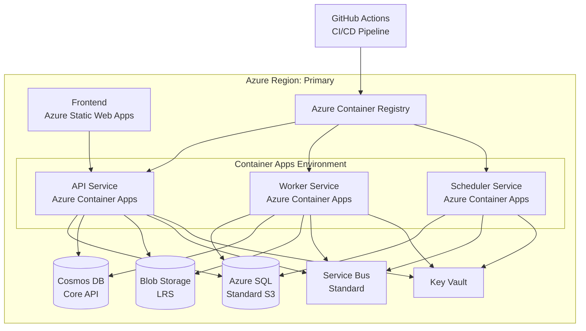

# KAATS — System Architecture

**KIU AI Agentic Test System**
Version: 1.0 | Status: Authoritative

---

## 1. Purpose and Scope

KAATS is a production-grade, multi-tenant SaaS platform that uses autonomous AI agents to automate the full test lifecycle: crawling live software systems to discover UI flows, generating test scripts from requirements, and executing those scripts with screenshot evidence. It is industry-agnostic — any company managing software applications can onboard without configuration changes to the core platform.

This document describes the production architecture. For agent internals see `AGENT_DESIGN.md`. For data entities see `DATA_MODEL.md`. For API conventions see `API_DESIGN.md`.

---

## 2. System Context



---

## 3. Container Architecture



---

## 4. Data Hierarchy

All data in KAATS is scoped through a strict parent-child hierarchy:

```
Global Platform
└── Enterprise  (e.g., "Acme Corp Holdings")
    └── Company  (e.g., "Acme North America")
        └── System  (e.g., "Acme CRM")
            ├── Requirement
            ├── TestScript
            │   └── TestCase
            │       └── TestStep
            └── TestExecution
                └── TestStepResult
                    └── EvidenceScreenshot
```

`tenant_id` throughout the application is the `Company.id`. Row-level security in Azure SQL is enforced by setting `SESSION_CONTEXT(N'tenant_id')` at connection time and using a security policy predicate on every tenant-scoped table.

---

## 5. Agent Subsystem

The three agents form a pipeline. Each is autonomous — a human can trigger any agent directly, or they can be chained via Service Bus events.



Each agent:
- Creates an `AgentRun` record in Azure SQL at start (status: `running`)
- Writes step traces to a Cosmos DB document during execution
- Tracks token usage per company for billing visibility
- Updates `AgentRun` status to `completed` or `failed` on exit
- On unrecoverable failure, publishes to the dead-letter queue and sets run status to `failed`

See `AGENT_DESIGN.md` for tool sets, memory model, and recovery logic.

---

## 6. Scheduling Architecture



See `SCHEDULING.md` for full lifecycle, failure escalation, and retry strategy.

---

## 7. Evidence Pipeline

```mermaid
flowchart TD
    A[ExecutionAgent runs step] --> B[Playwright captures PNG]
    B --> C[Pillow annotates:\nstep number, description, pass/fail overlay]
    C --> D[Upload to Blob Storage:\ntenant/{company_id}/evidence/{run_id}/step-{n}.png]
    D --> E[Write EvidenceScreenshot record in SQL]
    E --> F{All steps done?}
    F -- No --> A
    F -- Yes --> G[Build manifest JSON]
    G --> H[Generate PDF report via reportlab]
    H --> I[Upload PDF to Blob Storage]
    I --> J[SHA-256 integrity chain computed]
    J --> K[Update AgentRun: evidence_pdf_url, evidence_integrity_hash]
```

See `EVIDENCE_MODEL.md` for storage layout, annotation spec, and integrity chain.

---

## 8. Multi-Tenancy Model

| Layer | Mechanism |
|---|---|
| Application | Every API request carries a JWT; `company_id` is extracted and propagated via request context |
| Database | `SESSION_CONTEXT(N'tenant_id')` set on every connection acquisition; RLS security policy filters all reads/writes |
| Blob Storage | Containers are namespaced `tenant-{company_id}/` — service principal has no cross-tenant read |
| Cosmos DB | Per-tenant logical containers `kaats-{company_id}` with partition key `/project_id` |
| Service Bus | Shared topics; messages carry `company_id` in application properties; worker validates before processing |

See `ADR/002-multi-tenancy.md` for the decision rationale.

---

## 9. Security Posture

| Concern | Control |
|---|---|
| Authentication | JWT (Entra ID) on all API endpoints; token validated on every request |
| Authorization | RBAC enforced in application layer; roles: PlatformAdmin, EnterpriseAdmin, CompanyAdmin, SystemManager, QAEngineer, Viewer |
| Secret management | All secrets in Azure Key Vault; services use managed identity — no credentials in environment variables in production |
| Data in transit | HTTPS everywhere; Service Bus connections use AMQP over TLS |
| Data at rest | Azure SQL TDE (enabled by default); Blob encryption (Microsoft-managed keys) |
| Tenant isolation | RLS + namespace isolation (see above) |
| Agent sandboxing | Playwright runs in a headless, network-isolated Chromium container with no filesystem write access outside `/tmp/evidence` |

---

## 10. Deployment Architecture



---

## 11. Technology Decisions Summary

| Component | Technology | ADR |
|---|---|---|
| Backend framework | FastAPI 0.111 + Python 3.12 | ADR/001 |
| Frontend | React 18 + Vite + TypeScript | ADR/001 |
| Relational store | Azure SQL (aioodbc + SQLAlchemy 2.0 async) | ADR/001 |
| Document store | Azure Cosmos DB Core API | ADR/001 |
| AI agents | LangChain AgentExecutor + Azure OpenAI GPT-4o | ADR/003 |
| Browser automation | Playwright (async) | ADR/004 |
| Scheduling | In-process asyncio + Service Bus dispatch | ADR/005 |
| Multi-tenancy | RLS + namespace isolation | ADR/002 |
| Auth | Microsoft Entra ID + JWT | ADR/001 |

---

## 12. Quality Attributes

| Attribute | Target | Mechanism |
|---|---|---|
| Availability | 99.9% (API) | Azure Container Apps auto-scaling; SQL HA |
| Latency | p95 < 300 ms (API, non-agent) | Async I/O; connection pooling |
| Agent throughput | 50 concurrent runs per tenant | Worker horizontal scale-out on Service Bus depth |
| Tenant isolation | Zero cross-tenant data leakage | RLS + namespace isolation |
| Evidence integrity | SHA-256 chain on all artifacts | Hash chain computed at PDF generation |
| Audit | Full request + agent step logs | Structured logging to Azure Monitor |
