# KAATS — Data Model

Version: 1.0 | Status: Authoritative

---

## 1. Overview

KAATS uses two data stores:

| Store | Purpose | Engine |
|---|---|---|
| Azure SQL | All structured, relational data | Azure SQL Database (SQLAlchemy 2.0 async / aioodbc) |
| Azure Cosmos DB | Agent run documents with step-level traces | Core API (NoSQL) |

Blob Storage holds binary artifacts (screenshots, PDFs) — file paths are persisted in SQL.

---

## 2. Entity Relationship Diagram

```mermaid
erDiagram
    Enterprise {
        uuid id PK
        string name
        string slug
        bool is_active
        datetime created_at
    }
    Company {
        uuid id PK
        uuid enterprise_id FK
        string name
        string slug
        string business_domain
        bool is_active
        datetime created_at
    }
    User {
        uuid id PK
        string email
        string display_name
        bool is_active
        datetime created_at
    }
    UserCompanyRole {
        uuid id PK
        uuid user_id FK
        uuid company_id FK
        string role
        datetime granted_at
    }
    System {
        uuid id PK
        uuid company_id FK
        uuid owner_id FK
        string name
        string base_url
        string system_type
        string status
        json crawl_config
        json auth_config
        datetime created_at
        datetime updated_at
    }
    Requirement {
        uuid id PK
        uuid system_id FK
        uuid company_id FK
        string title
        text description
        string status
        int priority
        string source
        datetime created_at
        datetime updated_at
    }
    TestScript {
        uuid id PK
        uuid requirement_id FK
        uuid system_id FK
        uuid company_id FK
        string title
        string format
        string status
        datetime created_at
        datetime updated_at
    }
    TestCase {
        uuid id PK
        uuid script_id FK
        string name
        string description
        bool stop_on_failure
        int order_index
    }
    TestStep {
        uuid id PK
        uuid case_id FK
        int step_number
        string action
        text description
        string expected_outcome
        json parameters
    }
    TestExecution {
        uuid id PK
        uuid script_id FK
        uuid system_id FK
        uuid company_id FK
        uuid triggered_by FK
        string status
        int passed_count
        int failed_count
        int skipped_count
        datetime started_at
        datetime completed_at
        int duration_ms
    }
    TestStepResult {
        uuid id PK
        uuid execution_id FK
        uuid step_id FK
        string status
        text actual_outcome
        text failure_reason
        datetime executed_at
        int duration_ms
    }
    EvidenceScreenshot {
        uuid id PK
        uuid execution_id FK
        uuid step_result_id FK
        uuid company_id FK
        string blob_path
        string blob_url
        string sha256
        int step_number
        datetime captured_at
    }
    AgentRun {
        uuid id PK
        uuid company_id FK
        uuid system_id FK
        uuid triggered_by FK
        string agent_type
        string status
        int prompt_tokens
        int completion_tokens
        datetime started_at
        datetime completed_at
        int duration_ms
        uuid execution_id FK
        string cosmos_doc_id
    }
    ScheduledJob {
        uuid id PK
        uuid company_id FK
        uuid system_id FK
        uuid created_by FK
        string agent_type
        string cron_expression
        string timezone
        bool is_enabled
        int max_failures
        int consecutive_failures
        datetime next_run_at
        datetime last_run_at
        datetime created_at
        datetime updated_at
    }
    ScheduledJobRun {
        uuid id PK
        uuid job_id FK
        uuid agent_run_id FK
        string status
        datetime scheduled_for
        datetime started_at
        datetime completed_at
        string failure_reason
    }
    CompanyTokenUsage {
        uuid id PK
        uuid company_id FK
        string agent_type
        date usage_date
        int prompt_tokens
        int completion_tokens
    }

    Enterprise ||--o{ Company : "has"
    Company ||--o{ UserCompanyRole : "has"
    User ||--o{ UserCompanyRole : "holds"
    Company ||--o{ System : "owns"
    User ||--o{ System : "manages"
    System ||--o{ Requirement : "has"
    Requirement ||--o{ TestScript : "generates"
    TestScript ||--o{ TestCase : "contains"
    TestCase ||--o{ TestStep : "contains"
    TestScript ||--o{ TestExecution : "executed as"
    TestExecution ||--o{ TestStepResult : "produces"
    TestStepResult ||--o| EvidenceScreenshot : "has"
    TestExecution ||--o| AgentRun : "driven by"
    Company ||--o{ ScheduledJob : "has"
    System ||--o{ ScheduledJob : "targets"
    ScheduledJob ||--o{ ScheduledJobRun : "produces"
    AgentRun ||--o{ ScheduledJobRun : "linked to"
    Company ||--o{ CompanyTokenUsage : "accrues"
```



---

## 3. Table Definitions

### 3.1 Enterprise

```sql
CREATE TABLE enterprises (
    id          UNIQUEIDENTIFIER PRIMARY KEY DEFAULT NEWSEQUENTIALID(),
    name        NVARCHAR(255) NOT NULL,
    slug        NVARCHAR(100) NOT NULL UNIQUE,
    is_active   BIT NOT NULL DEFAULT 1,
    created_at  DATETIME2 NOT NULL DEFAULT GETUTCDATE()
);
```

### 3.2 Company

```sql
CREATE TABLE companies (
    id               UNIQUEIDENTIFIER PRIMARY KEY DEFAULT NEWSEQUENTIALID(),
    enterprise_id    UNIQUEIDENTIFIER NOT NULL REFERENCES enterprises(id),
    name             NVARCHAR(255) NOT NULL,
    slug             NVARCHAR(100) NOT NULL,
    business_domain  NVARCHAR(500),         -- free-text, e.g. "Healthcare Claims Processing"
    is_active        BIT NOT NULL DEFAULT 1,
    created_at       DATETIME2 NOT NULL DEFAULT GETUTCDATE(),
    UNIQUE (enterprise_id, slug)
);
```

### 3.3 Users and Roles

```sql
CREATE TABLE users (
    id            UNIQUEIDENTIFIER PRIMARY KEY DEFAULT NEWSEQUENTIALID(),
    email         NVARCHAR(320) NOT NULL UNIQUE,
    display_name  NVARCHAR(255),
    entra_oid     NVARCHAR(128) UNIQUE,     -- Microsoft Entra Object ID
    is_active     BIT NOT NULL DEFAULT 1,
    created_at    DATETIME2 NOT NULL DEFAULT GETUTCDATE()
);

CREATE TABLE user_company_roles (
    id           UNIQUEIDENTIFIER PRIMARY KEY DEFAULT NEWSEQUENTIALID(),
    user_id      UNIQUEIDENTIFIER NOT NULL REFERENCES users(id),
    company_id   UNIQUEIDENTIFIER NOT NULL REFERENCES companies(id),
    role         NVARCHAR(50) NOT NULL,      -- platform_admin|enterprise_admin|company_admin|system_manager|qa_engineer|viewer
    granted_by   UNIQUEIDENTIFIER REFERENCES users(id),
    granted_at   DATETIME2 NOT NULL DEFAULT GETUTCDATE(),
    UNIQUE (user_id, company_id, role)
);
```

### 3.4 System

```sql
CREATE TABLE systems (
    id            UNIQUEIDENTIFIER PRIMARY KEY DEFAULT NEWSEQUENTIALID(),
    company_id    UNIQUEIDENTIFIER NOT NULL REFERENCES companies(id),
    owner_id      UNIQUEIDENTIFIER NOT NULL REFERENCES users(id),
    name          NVARCHAR(255) NOT NULL,
    base_url      NVARCHAR(2048) NOT NULL,
    system_type   NVARCHAR(100) NOT NULL,    -- web_app|api|mobile_web|desktop_web|other
    status        NVARCHAR(50) NOT NULL DEFAULT 'active',
    crawl_config  NVARCHAR(MAX),             -- JSON: max_pages, exclude_patterns, etc.
    auth_config   NVARCHAR(MAX),             -- JSON: encrypted credentials ref (Key Vault secret name)
    created_at    DATETIME2 NOT NULL DEFAULT GETUTCDATE(),
    updated_at    DATETIME2 NOT NULL DEFAULT GETUTCDATE()
);
```

### 3.5 Requirements

```sql
CREATE TABLE requirements (
    id          UNIQUEIDENTIFIER PRIMARY KEY DEFAULT NEWSEQUENTIALID(),
    system_id   UNIQUEIDENTIFIER NOT NULL REFERENCES systems(id),
    company_id  UNIQUEIDENTIFIER NOT NULL REFERENCES companies(id),
    title       NVARCHAR(500) NOT NULL,
    description NVARCHAR(MAX) NOT NULL,
    status      NVARCHAR(50) NOT NULL DEFAULT 'draft',  -- draft|approved|deprecated
    priority    TINYINT NOT NULL DEFAULT 2,              -- 1=high, 2=medium, 3=low
    source      NVARCHAR(50) NOT NULL DEFAULT 'agent',   -- agent|manual
    created_at  DATETIME2 NOT NULL DEFAULT GETUTCDATE(),
    updated_at  DATETIME2 NOT NULL DEFAULT GETUTCDATE()
);
```

### 3.6 Test Scripts, Cases, Steps

```sql
CREATE TABLE test_scripts (
    id              UNIQUEIDENTIFIER PRIMARY KEY DEFAULT NEWSEQUENTIALID(),
    requirement_id  UNIQUEIDENTIFIER REFERENCES requirements(id),
    system_id       UNIQUEIDENTIFIER NOT NULL REFERENCES systems(id),
    company_id      UNIQUEIDENTIFIER NOT NULL REFERENCES companies(id),
    title           NVARCHAR(500) NOT NULL,
    format          NVARCHAR(50) NOT NULL,    -- playwright_python|gherkin|manual_steps|selenium_java|cypress_js
    status          NVARCHAR(50) NOT NULL DEFAULT 'draft',
    created_at      DATETIME2 NOT NULL DEFAULT GETUTCDATE(),
    updated_at      DATETIME2 NOT NULL DEFAULT GETUTCDATE()
);

CREATE TABLE test_cases (
    id               UNIQUEIDENTIFIER PRIMARY KEY DEFAULT NEWSEQUENTIALID(),
    script_id        UNIQUEIDENTIFIER NOT NULL REFERENCES test_scripts(id),
    name             NVARCHAR(500) NOT NULL,
    description      NVARCHAR(MAX),
    stop_on_failure  BIT NOT NULL DEFAULT 0,
    order_index      INT NOT NULL DEFAULT 0
);

CREATE TABLE test_steps (
    id               UNIQUEIDENTIFIER PRIMARY KEY DEFAULT NEWSEQUENTIALID(),
    case_id          UNIQUEIDENTIFIER NOT NULL REFERENCES test_cases(id),
    step_number      INT NOT NULL,
    action           NVARCHAR(100) NOT NULL,   -- navigate|click|fill|assert|wait|select|submit
    description      NVARCHAR(MAX) NOT NULL,
    expected_outcome NVARCHAR(MAX),
    parameters       NVARCHAR(MAX),            -- JSON: selector, value, url, timeout, etc.
    UNIQUE (case_id, step_number)
);
```

### 3.7 Test Executions and Results

```sql
CREATE TABLE test_executions (
    id             UNIQUEIDENTIFIER PRIMARY KEY DEFAULT NEWSEQUENTIALID(),
    script_id      UNIQUEIDENTIFIER NOT NULL REFERENCES test_scripts(id),
    system_id      UNIQUEIDENTIFIER NOT NULL REFERENCES systems(id),
    company_id     UNIQUEIDENTIFIER NOT NULL REFERENCES companies(id),
    triggered_by   UNIQUEIDENTIFIER REFERENCES users(id),
    status         NVARCHAR(50) NOT NULL DEFAULT 'pending',  -- pending|running|passed|failed|error
    passed_count   INT NOT NULL DEFAULT 0,
    failed_count   INT NOT NULL DEFAULT 0,
    skipped_count  INT NOT NULL DEFAULT 0,
    started_at     DATETIME2,
    completed_at   DATETIME2,
    duration_ms    INT
);

CREATE TABLE test_step_results (
    id              UNIQUEIDENTIFIER PRIMARY KEY DEFAULT NEWSEQUENTIALID(),
    execution_id    UNIQUEIDENTIFIER NOT NULL REFERENCES test_executions(id),
    step_id         UNIQUEIDENTIFIER NOT NULL REFERENCES test_steps(id),
    status          NVARCHAR(50) NOT NULL,   -- passed|failed|skipped|error
    actual_outcome  NVARCHAR(MAX),
    failure_reason  NVARCHAR(MAX),
    executed_at     DATETIME2,
    duration_ms     INT
);

CREATE TABLE evidence_screenshots (
    id              UNIQUEIDENTIFIER PRIMARY KEY DEFAULT NEWSEQUENTIALID(),
    execution_id    UNIQUEIDENTIFIER NOT NULL REFERENCES test_executions(id),
    step_result_id  UNIQUEIDENTIFIER REFERENCES test_step_results(id),
    company_id      UNIQUEIDENTIFIER NOT NULL REFERENCES companies(id),
    blob_path       NVARCHAR(2048) NOT NULL,
    blob_url        NVARCHAR(2048),          -- pre-signed SAS URL (ephemeral)
    sha256          NCHAR(64) NOT NULL,
    step_number     INT NOT NULL,
    captured_at     DATETIME2 NOT NULL DEFAULT GETUTCDATE()
);
```

### 3.8 Agent Runs

```sql
CREATE TABLE agent_runs (
    id                UNIQUEIDENTIFIER PRIMARY KEY DEFAULT NEWSEQUENTIALID(),
    company_id        UNIQUEIDENTIFIER NOT NULL REFERENCES companies(id),
    system_id         UNIQUEIDENTIFIER REFERENCES systems(id),
    triggered_by      UNIQUEIDENTIFIER REFERENCES users(id),
    agent_type        NVARCHAR(50) NOT NULL,   -- crawl|generation|execution
    status            NVARCHAR(50) NOT NULL DEFAULT 'running',  -- running|completed|failed|timed_out
    prompt_tokens     INT NOT NULL DEFAULT 0,
    completion_tokens INT NOT NULL DEFAULT 0,
    started_at        DATETIME2 NOT NULL DEFAULT GETUTCDATE(),
    completed_at      DATETIME2,
    duration_ms       INT,
    execution_id      UNIQUEIDENTIFIER REFERENCES test_executions(id),
    cosmos_doc_id     NVARCHAR(255)             -- Cosmos document ID for step traces
);
```

### 3.9 Scheduled Jobs

```sql
CREATE TABLE scheduled_jobs (
    id                    UNIQUEIDENTIFIER PRIMARY KEY DEFAULT NEWSEQUENTIALID(),
    company_id            UNIQUEIDENTIFIER NOT NULL REFERENCES companies(id),
    system_id             UNIQUEIDENTIFIER NOT NULL REFERENCES systems(id),
    created_by            UNIQUEIDENTIFIER REFERENCES users(id),
    agent_type            NVARCHAR(50) NOT NULL,
    cron_expression       NVARCHAR(100) NOT NULL,    -- standard 5-field cron
    timezone              NVARCHAR(100) NOT NULL DEFAULT 'UTC',
    is_enabled            BIT NOT NULL DEFAULT 1,
    max_failures          INT NOT NULL DEFAULT 3,
    consecutive_failures  INT NOT NULL DEFAULT 0,
    next_run_at           DATETIME2 NOT NULL,
    last_run_at           DATETIME2,
    created_at            DATETIME2 NOT NULL DEFAULT GETUTCDATE(),
    updated_at            DATETIME2 NOT NULL DEFAULT GETUTCDATE()
);

CREATE TABLE scheduled_job_runs (
    id              UNIQUEIDENTIFIER PRIMARY KEY DEFAULT NEWSEQUENTIALID(),
    job_id          UNIQUEIDENTIFIER NOT NULL REFERENCES scheduled_jobs(id),
    agent_run_id    UNIQUEIDENTIFIER REFERENCES agent_runs(id),
    status          NVARCHAR(50) NOT NULL DEFAULT 'enqueued',  -- enqueued|running|completed|failed
    scheduled_for   DATETIME2 NOT NULL,
    started_at      DATETIME2,
    completed_at    DATETIME2,
    failure_reason  NVARCHAR(MAX)
);
```

### 3.10 Token Usage

```sql
CREATE TABLE company_token_usage (
    id                UNIQUEIDENTIFIER PRIMARY KEY DEFAULT NEWSEQUENTIALID(),
    company_id        UNIQUEIDENTIFIER NOT NULL REFERENCES companies(id),
    agent_type        NVARCHAR(50) NOT NULL,
    usage_date        DATE NOT NULL,
    prompt_tokens     INT NOT NULL DEFAULT 0,
    completion_tokens INT NOT NULL DEFAULT 0,
    UNIQUE (company_id, agent_type, usage_date)
);
```

---

## 4. Tenant Isolation Strategy

### Row-Level Security

All tenant-scoped tables have an RLS security policy. The tenant predicate is:

```sql
CREATE FUNCTION dbo.fn_tenant_predicate(@company_id UNIQUEIDENTIFIER)
RETURNS TABLE
WITH SCHEMABINDING
AS RETURN SELECT 1 AS result
WHERE CAST(SESSION_CONTEXT(N'tenant_id') AS UNIQUEIDENTIFIER) = @company_id;

-- Applied to each tenant table:
CREATE SECURITY POLICY TenantIsolationPolicy
ADD FILTER PREDICATE dbo.fn_tenant_predicate(company_id) ON dbo.systems,
ADD FILTER PREDICATE dbo.fn_tenant_predicate(company_id) ON dbo.requirements,
ADD FILTER PREDICATE dbo.fn_tenant_predicate(company_id) ON dbo.test_scripts,
ADD FILTER PREDICATE dbo.fn_tenant_predicate(company_id) ON dbo.test_executions,
ADD FILTER PREDICATE dbo.fn_tenant_predicate(company_id) ON dbo.evidence_screenshots,
ADD FILTER PREDICATE dbo.fn_tenant_predicate(company_id) ON dbo.agent_runs,
ADD FILTER PREDICATE dbo.fn_tenant_predicate(company_id) ON dbo.scheduled_jobs,
ADD FILTER PREDICATE dbo.fn_tenant_predicate(company_id) ON dbo.company_token_usage
WITH (STATE = ON);
```

The application layer sets the context on every connection acquisition:

```python
# In SQLAlchemy event handler
@event.listens_for(engine.sync_engine, "connect")
def set_tenant_context(dbapi_conn, connection_record):
    # Set at checkout time via connection pool event
    pass

# In middleware, after each connection checkout:
await session.execute(
    text("EXEC sp_set_session_context @key = N'tenant_id', @value = :tid"),
    {"tid": str(request.state.company_id)}
)
```

### Table Scope Reference

| Table | Tenant-scoped? | Notes |
|---|---|---|
| enterprises | No | Global table, platform admin only |
| companies | No (enterprise-scoped) | Filtered by enterprise_id in app layer |
| users | No | Identity table; no tenant data |
| user_company_roles | No | Join table; app-layer filtered |
| systems | Yes (`company_id`) | RLS |
| requirements | Yes (`company_id`) | RLS |
| test_scripts | Yes (`company_id`) | RLS |
| test_cases | Inherited | Filtered via script_id join |
| test_steps | Inherited | Filtered via case_id join |
| test_executions | Yes (`company_id`) | RLS |
| test_step_results | Inherited | Filtered via execution_id join |
| evidence_screenshots | Yes (`company_id`) | RLS |
| agent_runs | Yes (`company_id`) | RLS |
| scheduled_jobs | Yes (`company_id`) | RLS |
| scheduled_job_runs | Inherited | Filtered via job_id join |
| company_token_usage | Yes (`company_id`) | RLS |

---

## 5. Cosmos DB Schema

Each agent run creates one document in the `agent-runs` container.

```json
{
  "id": "550e8400-e29b-41d4-a716-446655440000",
  "company_id": "tenant-uuid",
  "system_id": "system-uuid",
  "agent_type": "execution",
  "status": "completed",
  "started_at": "2026-05-13T10:00:00Z",
  "completed_at": "2026-05-13T10:12:34Z",
  "prompt_tokens": 12450,
  "completion_tokens": 3210,
  "working_memory_snapshot": { ... },
  "steps": [
    {
      "step_index": 1,
      "thought": "I need to navigate to the login page first.",
      "tool": "navigate_to_url",
      "tool_input": { "url": "https://app.example.com/login" },
      "observation": "Page loaded. Title: 'Login — Example App'",
      "timestamp": "2026-05-13T10:00:05Z",
      "duration_ms": 823,
      "tokens_this_step": { "prompt": 512, "completion": 128 }
    }
  ],
  "_partitionKey": "tenant-uuid"
}
```

Partition key is `company_id` to ensure cross-tenant isolation at the Cosmos logical container level.

---

## 6. Indexes

Key performance indexes (beyond PKs and FKs):

```sql
-- Agent run lookups by company + status
CREATE INDEX ix_agent_runs_company_status ON agent_runs (company_id, status, started_at DESC);

-- Scheduler polling
CREATE INDEX ix_scheduled_jobs_next_run ON scheduled_jobs (is_enabled, next_run_at) WHERE is_enabled = 1;

-- Evidence by execution
CREATE INDEX ix_evidence_execution ON evidence_screenshots (execution_id, step_number);

-- Token usage by company and date range
CREATE INDEX ix_token_usage_company_date ON company_token_usage (company_id, usage_date DESC);

-- Requirement lookup by system
CREATE INDEX ix_requirements_system ON requirements (system_id, status);
```
