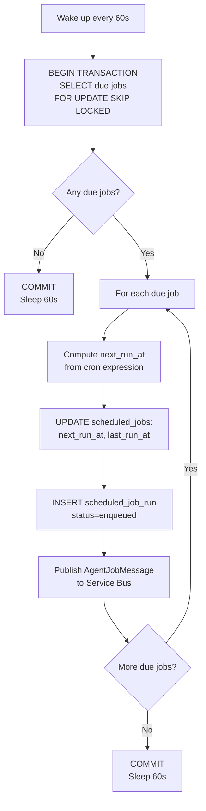
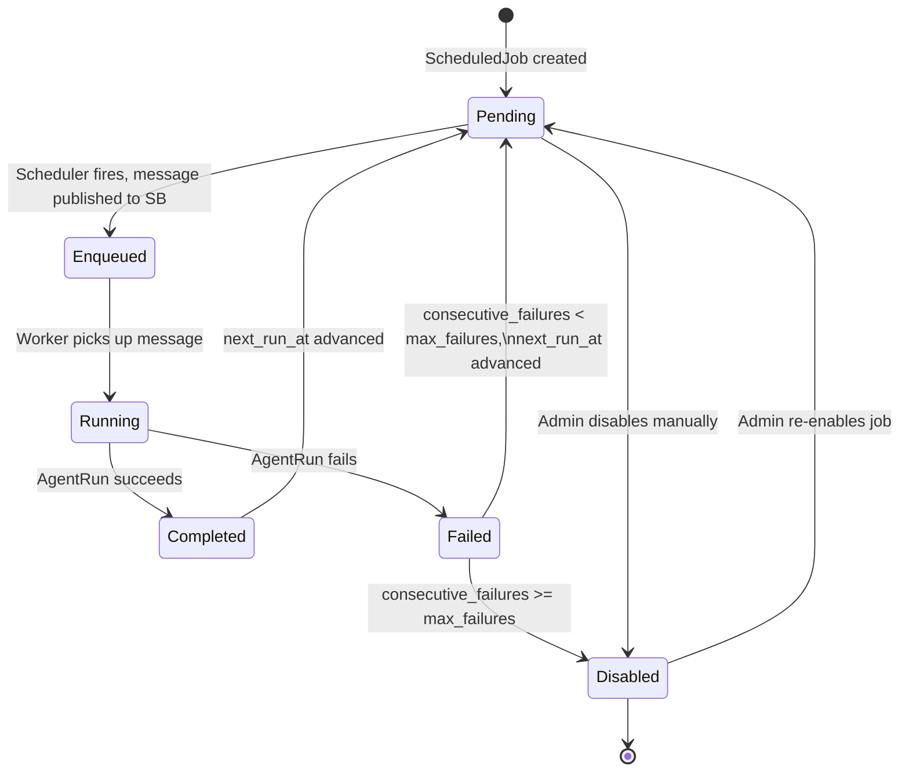

# KAATS — Scheduling Model

Version: 1.0 | Status: Authoritative

---

## 1. Overview

KAATS supports three agent invocation modes:

| Mode | Trigger | Implementation |
|---|---|---|
| On-demand | REST API call | `POST /api/v1/systems/{id}/agents/{type}` publishes directly to Service Bus |
| One-shot | Future datetime | `ScheduledJob` with a cron expression that fires once; disabled after first run |
| Recurring | Cron expression | `ScheduledJob` with standard 5-field cron; `next_run_at` advanced after each fire |

The Scheduler Service is a lightweight asyncio loop running inside its own Azure Container Apps instance. It polls `scheduled_jobs` every 60 seconds, enqueues due jobs to Service Bus, and updates `next_run_at`. The Worker Service processes the jobs.

See `ADR/005-scheduling.md` for the technology decision rationale.

---

## 2. Scheduled Job Record

```sql
CREATE TABLE scheduled_jobs (
    id                    UNIQUEIDENTIFIER PRIMARY KEY DEFAULT NEWSEQUENTIALID(),
    company_id            UNIQUEIDENTIFIER NOT NULL,
    system_id             UNIQUEIDENTIFIER NOT NULL,
    created_by            UNIQUEIDENTIFIER,
    agent_type            NVARCHAR(50) NOT NULL,       -- crawl|generation|execution
    cron_expression       NVARCHAR(100) NOT NULL,      -- standard 5-field cron
    timezone              NVARCHAR(100) NOT NULL DEFAULT 'UTC',
    is_enabled            BIT NOT NULL DEFAULT 1,
    max_failures          INT NOT NULL DEFAULT 3,      -- auto-disable threshold
    consecutive_failures  INT NOT NULL DEFAULT 0,
    next_run_at           DATETIME2 NOT NULL,           -- UTC; set on create, advanced after each fire
    last_run_at           DATETIME2,
    created_at            DATETIME2 NOT NULL DEFAULT GETUTCDATE(),
    updated_at            DATETIME2 NOT NULL DEFAULT GETUTCDATE()
);
```

### Cron Expression Format

Standard 5-field Unix cron:

```
┌─────── minute (0–59)
│ ┌───── hour (0–23, UTC unless timezone set)
│ │ ┌─── day-of-month (1–31)
│ │ │ ┌─ month (1–12)
│ │ │ │ ┌ day-of-week (0–7, 0 and 7 = Sunday)
│ │ │ │ │
* * * * *
```

| Expression | Meaning |
|---|---|
| `0 2 * * 1` | Every Monday at 02:00 UTC |
| `0 0 * * *` | Daily at midnight UTC |
| `*/30 * * * *` | Every 30 minutes |
| `0 9 1 * *` | 1st of every month at 09:00 UTC |

Validation uses `croniter`. The API rejects expressions that would fire more frequently than once per minute.

---

## 3. Scheduler Loop

```python
async def scheduler_loop():
    while True:
        try:
            await _evaluate_due_jobs()
        except Exception as exc:
            log.error("Scheduler evaluation error", exc_info=exc)
        await asyncio.sleep(SCHEDULER_INTERVAL_SECONDS)  # default: 60
```

### Evaluation Logic



The `FOR UPDATE SKIP LOCKED` clause ensures that if two Scheduler instances run simultaneously (e.g., during a rolling deployment), they do not double-fire the same job.

### AgentJobMessage Schema

```json
{
  "job_id": "uuid",
  "job_run_id": "uuid",
  "company_id": "uuid",
  "system_id": "uuid",
  "agent_type": "crawl",
  "scheduled_for": "2026-05-13T02:00:00Z",
  "metadata": {}
}
```

---

## 4. Job Lifecycle



---

## 5. Failure and Retry Strategy

### Per-Run Retry (Worker Level)

The Worker retries transient agent failures up to 3 times with exponential backoff before marking the run as `failed`. This is the agent-level retry described in `AGENT_DESIGN.md`.

### Per-Job Failure Escalation (Scheduler Level)

When a `ScheduledJobRun` completes with status `failed`:

1. The Worker increments `scheduled_jobs.consecutive_failures`.
2. If `consecutive_failures >= max_failures`:
   - `is_enabled` is set to `false`.
   - An alert record is inserted into the `alerts` table.
   - Azure Monitor alert rule fires and notifies the company admin.
3. If `consecutive_failures < max_failures`:
   - The job remains enabled.
   - `next_run_at` is advanced normally.
   - The failure count is visible in the UI.

When a run completes with status `completed`:
- `consecutive_failures` is reset to `0`.

### Summary Table

| Failure Type | Recovery |
|---|---|
| Transient agent error (rate limit, network) | Worker retries up to 3× with backoff |
| Agent max retries exceeded → `AgentRun.status = failed` | Scheduler increments `consecutive_failures` |
| `consecutive_failures < max_failures` | Job re-schedules normally |
| `consecutive_failures >= max_failures` | Job auto-disabled; admin alert fired |
| Admin re-enables job | `consecutive_failures` reset to 0; `next_run_at` recomputed from now |

---

## 6. next_run_at Computation

`next_run_at` is computed using `croniter`:

```python
from croniter import croniter
from datetime import datetime, timezone
import pytz

def compute_next_run(cron_expression: str, timezone_str: str, after: datetime) -> datetime:
    tz = pytz.timezone(timezone_str)
    after_local = after.astimezone(tz)
    cron = croniter(cron_expression, after_local)
    next_local = cron.get_next(datetime)
    return next_local.astimezone(timezone.utc)
```

On job creation, `next_run_at` is set to `compute_next_run(cron, timezone, now_utc)`.

After each fire, `next_run_at` is advanced to `compute_next_run(cron, timezone, fire_time)`.

---

## 7. Priority Queue

Jobs are classified by priority tier. The Scheduler orders evaluation within a polling cycle:

| Priority | Value | Assignment |
|---|---|---|
| Critical | 1 | Manually assigned by Company Admin |
| High | 2 | Execution agent jobs |
| Normal | 3 | Generation agent jobs (default) |
| Low | 4 | Crawl agent jobs |

Within the same priority, jobs are ordered by `next_run_at ASC` (oldest due first).

Service Bus message priority is set to match (0–9 scale mapped from 1–4).

---

## 8. API Endpoints

See `API_DESIGN.md` §7.8 for the full endpoint list.

Key behaviours:

- `POST /scheduled_jobs` — Validates cron expression; computes and sets `next_run_at`.
- `PUT /scheduled_jobs/{id}` — If cron or timezone changes, recomputes `next_run_at` from now.
- `POST /scheduled_jobs/{id}/trigger` — Immediately publishes an `AgentJobMessage` without waiting for the next scheduled time. Does not affect `next_run_at`.
- `DELETE /scheduled_jobs/{id}` — Hard-deletes. In-flight runs continue to completion.

---

## 9. Operational Considerations

### Scheduler Startup
On startup, the Scheduler Service scans for jobs whose `next_run_at` is in the past and fires them immediately (catch-up). This handles the case where the service was down during a scheduled window.

Catch-up is limited to jobs at most **24 hours** overdue. Jobs more than 24 hours overdue are skipped (their `next_run_at` is advanced to the next future occurrence) to avoid flooding the queue after a prolonged outage.

### Exactly-Once Semantics
Service Bus Standard tier provides at-least-once delivery. The Worker is idempotent per `job_run_id` — it checks whether a `ScheduledJobRun` record already has status `running` or `completed` before processing, and discards duplicate messages.

### Time Zone Handling
All timestamps stored in SQL and Cosmos DB are UTC. `timezone` on the `ScheduledJob` is used only for `next_run_at` computation. The UI displays times in the user's browser timezone.
